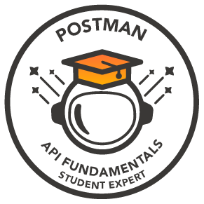

 

# 💫 About Me:
🌱 Hi, I’m Ashutosh Kumar(@AshutoshKumar0206) 💬 I am interested in Web Developement, Cloud, AI/ML 📫-How to reach me? - 🔭 Email - ashutoshkumar200302@gmail.com ✨ Dm me on Linkedin - linkedin/in/ashutosh0203 😄 Pronouns: He/Him ⚡ Fun fact: Looking for that :)

## 🌐 Socials:
  

# 💻 Tech Stack:
                                   

# 📊 GitHub Stats:
 
 

### 🔝 Top Contributed Repo

---

<!-- Proudly created with GPRM ( https://gprm.itsvg.in ) -->

## Achievements
 

Postman API Fundamentals Student Expert

<!--
**AshutoshKumar0206/AshutoshKumar0206** is a ✨ _special_ ✨ repository because its `README.md` (this file) appears on your GitHub profile.

Here are some ideas to get you started:

- 🔭 I’m currently working on ...
- 🌱 I’m currently learning ...
- 👯 I’m looking to collaborate on ...
- 🤔 I’m looking for help with ...
- 💬 Ask me about ...
- 📫 How to reach me: ...
- 😄 Pronouns: ...
- ⚡ Fun fact: ...
-->
